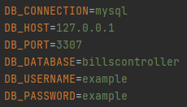

# BillsController API

[pt-BR] 
Essa API foi desenvolvida para ser o backend de um trabalho da matéria "Tecnologias Web".

[en-US] 
This API was developed to be the backend of a work on the subject "Web Technologies".

## Running

[pt-BR]
Para rodar a aplicação basta renomear o arquivo .env.example para .env, colocar as informações referente ao banco



Abra o terminal e navegue até a pasta, então rode as migrations utilizando o comando:
```shell
php artisan migrate 
```

>Se quiser adicionar uma amostra de dados rode:
>```shell
>php artisan db:seed
>```

Para servir a API é só rodar o comando padrão para servir em PHP:
```shell
php -S localhost:8000
```
Lembrando que a porta fica à sua escolha.

[en-US]
To run the application just rename the .env.example file to .env, put the information for the bank


Open the terminal and navigate to the folder, then run the migrations using the command:
```shell
php artisan migrate 
```
>If you want to add a sample of data, run:
>```shell
>php artisan db:seed
>```

To serve the API, just run the standard command to serve in PHP:
```shell
php -S localhost:8000
```
Remembering that the door is your choice.

## Framework

[Lumen - The stunningly fast micro-framework by Laravel](https://lumen.laravel.com)
